<p align="center">
  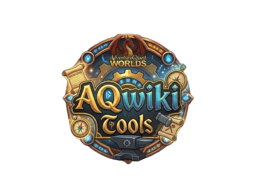
</p>

<h1 align="center">AQWikiTools</h1>

<p align="center">
  <strong>A Chrome extension that supercharges the AQW Wiki with item previews, calculators, inventory tracking, dark mode, and more.</strong>
</p>

<p align="center">
  
  
  
  
</p>

---

## Overview

**AQWikiTools** is a Chrome Manifest V3 extension built for [AdventureQuest Worlds](https://www.aq.com/) players who browse the [AQW Wiki](http://aqwwiki.wikidot.com/). It injects rich functionality directly into wiki and account pages — hover previews, merge/quest calculators, owned-item indicators, full dark mode, and a standalone Farm Tracker with thousands of items — so you never have to leave the wiki to plan your next grind.

The extension syncs your in-game inventory from [account.aq.com](https://account.aq.com) and uses it across every feature: highlighting items you own, calculating what you still need, and tracking your overall collection progress.

---

## Features

### Extension Popup
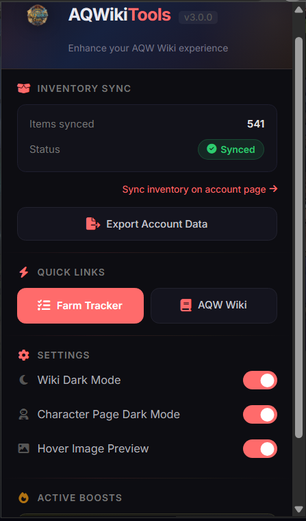

Quick access to inventory sync status, settings, dark mode toggles, and the Farm Tracker — all from one clean toolbar popup.

### Settings & Active Boosts
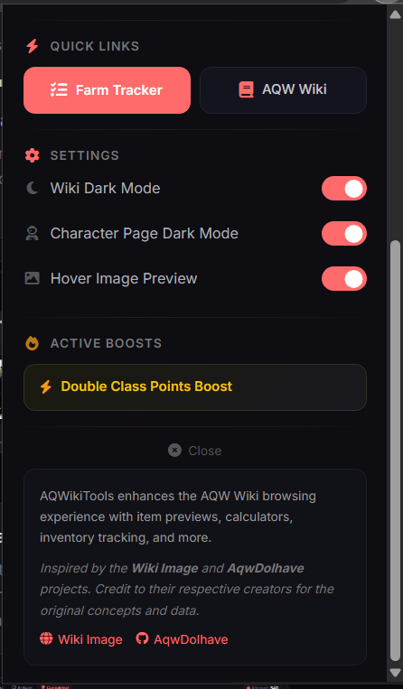

Toggle dark mode, image previews, and character page settings. View your active server boosts (Gold, XP, Rep, Class Points) and jump straight to the Farm Tracker or AQW Wiki.

### Dark Mode & Owned Items
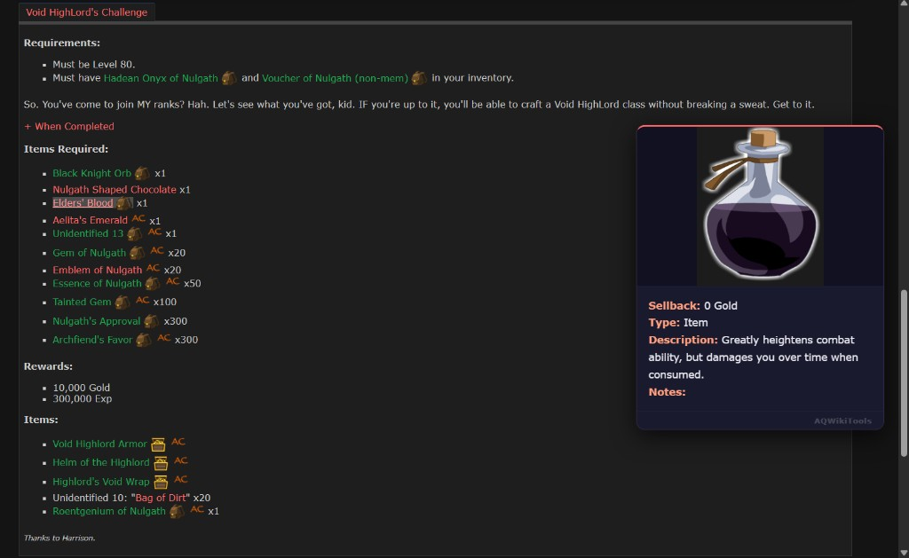

Full wiki dark mode with owned-item highlighting. Items you own are color-coded with bank/inventory icons displayed right on the page.

### Hover Image Preview
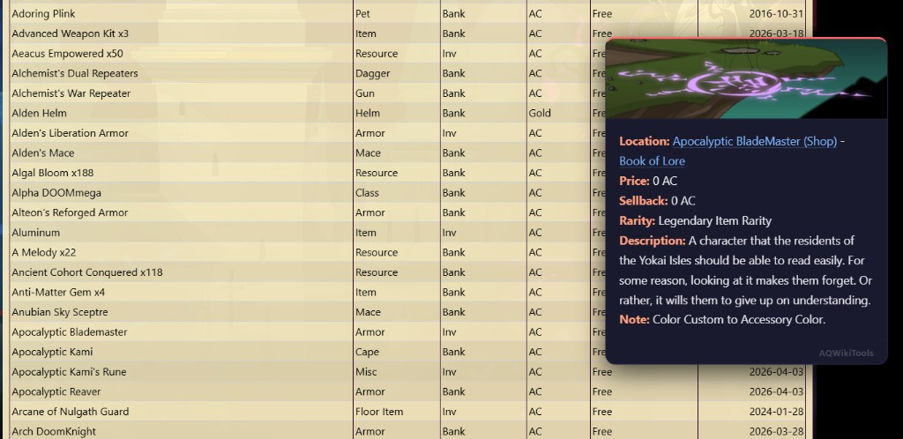

Hover over any item link to see a detailed tooltip with the item image, location, rarity, price, and description — no page navigation required.

### Quest Calculator
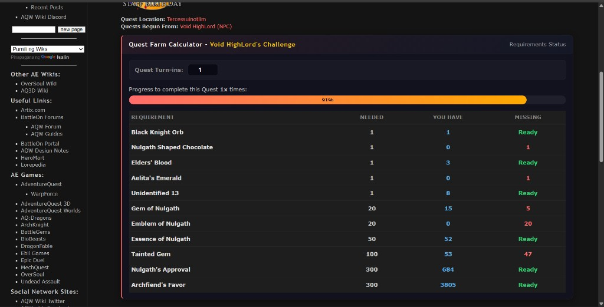

Automatically detects quest pages and builds a live progress calculator showing needed vs. owned materials, quantities still missing, and an overall progress bar.

### Farm Tracker — To Drop
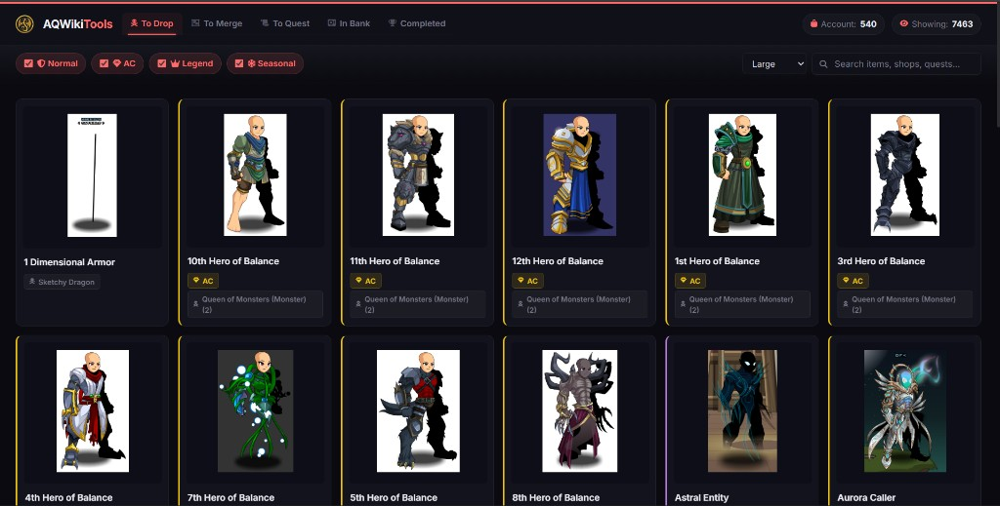

Browse every unowned drop item in a filterable, searchable card grid. Filter by rarity (AC, Seasonal, Non-Rare, Legend) and view drop source details at a glance.

### Item Detail & Source Preview
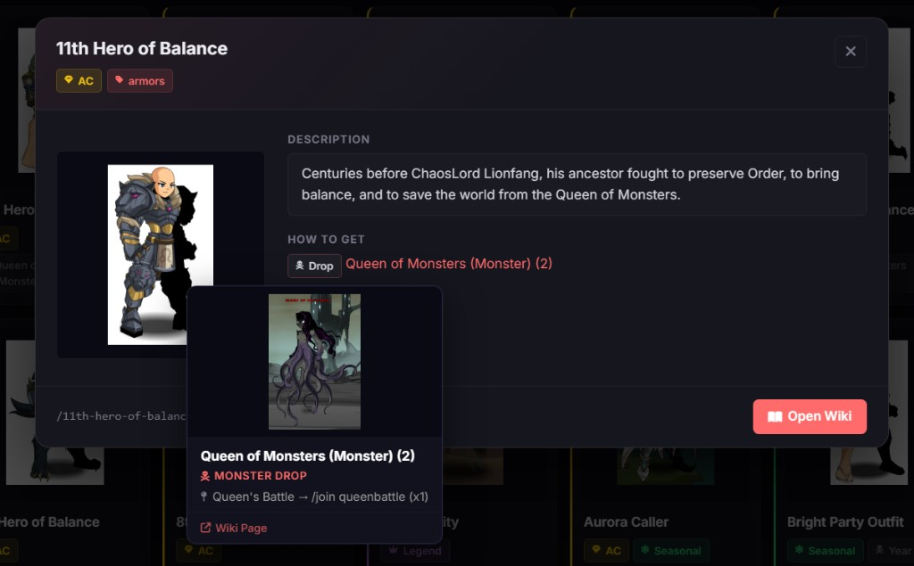

Click any item to open a detailed modal with its description and drop sources. Hover a source entry to preview the monster image and map location.

### Farm Tracker — To Merge
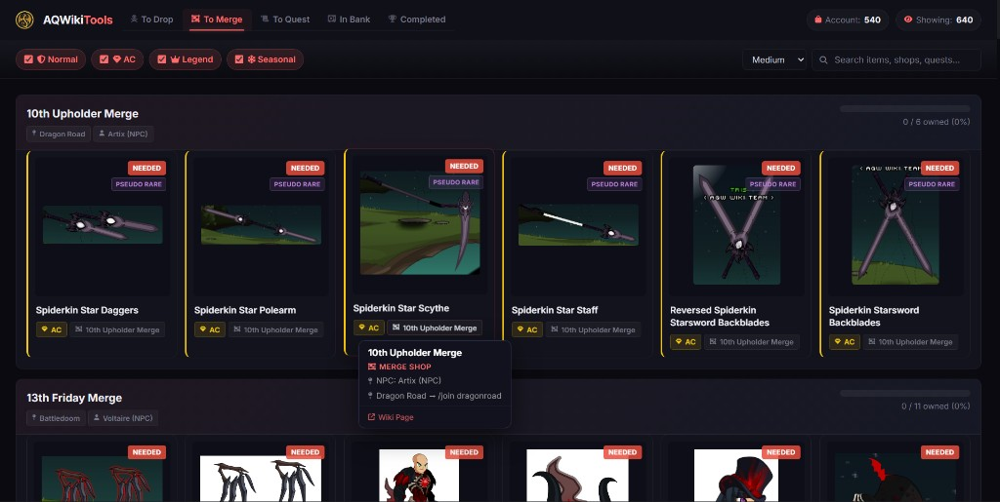

View all unowned merge shop items grouped by shop. Each group shows NEEDED badges and an ownership progress indicator per shop.

### In Bank View
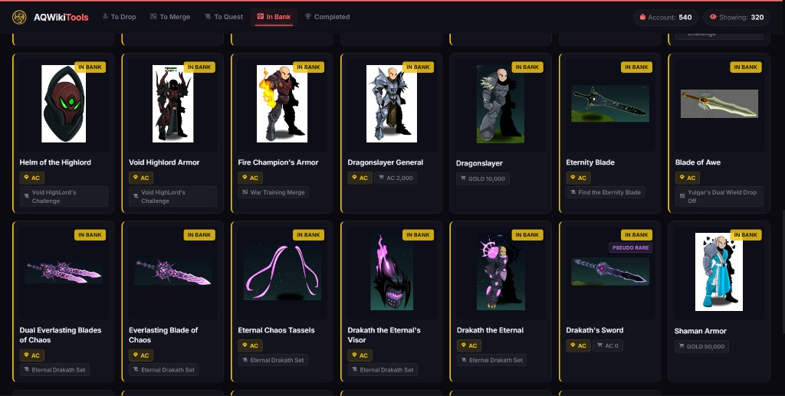

See all your banked items displayed in a card grid with IN BANK badges, rarity tags, and source information.

### Collection Stats
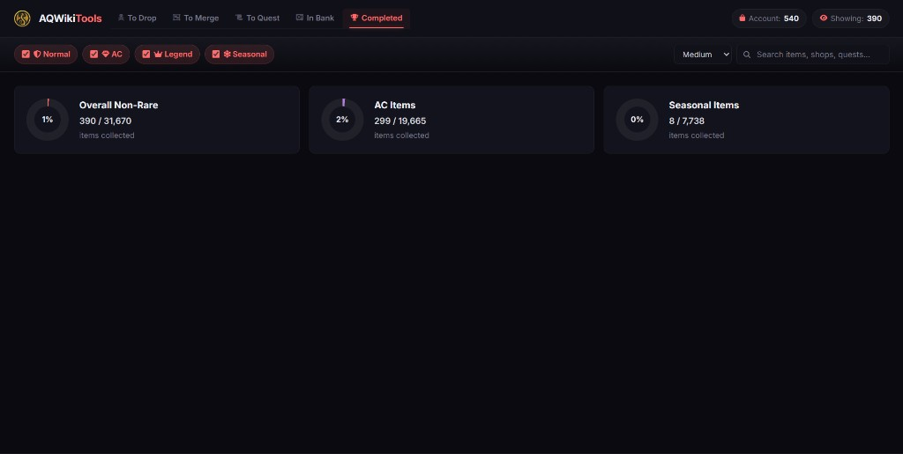

Track your overall collection completion with donut charts broken down by Non-Rare, AC, and Seasonal categories.

### Character Page Compare
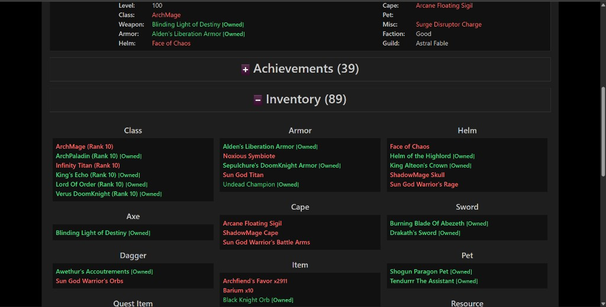

When viewing another player's character page, an **[Owned]** tag appears next to items you also own — instantly compare inventories at a glance.

---

## Tech Stack

| Layer | Technology |
|-------|------------|
| **Platform** | Chrome Extension — Manifest V3 |
| **Language** | Vanilla JavaScript (no build step / bundler) |
| **Styling** | Plain CSS with CSS custom properties |
| **Browser APIs** | `chrome.storage.local`, `chrome.runtime`, `chrome.tabs`, Content Scripts, Service Worker |
| **External Data** | Fetch to AQW Wiki (item HTML), Artix.com calendar (server boosts) |
| **Fonts** | [Inter](https://fonts.google.com/specimen/Inter) via Google Fonts |
| **Icons** | [Font Awesome 6.5](https://fontawesome.com/) via CDN |

---

## Project Structure

```
AQWikiTools/
├── manifest.json                   # Extension manifest (MV3)
│
├── assets/
│   ├── icons/                      # Toolbar icons (16, 48, 128 px)
│   └── images/                     # In-page assets (banner, boost icons, bank/inventory badges)
│
├── data/
│   ├── WikiItems.json              # Master item database (~thousands of entries)
│   ├── merge_shops.json            # Merge shop definitions with ingredients and NPCs
│   ├── quests.json                 # Quest data with requirements and locations
│   └── locations.json              # Map/monster index for source tooltips
│
├── src/
│   ├── pages/
│   │   ├── popup.html              # Toolbar popup UI
│   │   └── farm-tracker.html       # Full-page Farm Tracker (opens in new tab)
│   │
│   ├── scripts/
│   │   ├── background.js           # Service worker — proxies fetch requests to wiki & Artix
│   │   ├── content.js              # Content script — hover previews, calculators, dark mode, owned badges, boost banners
│   │   ├── inventory-sync.js       # Content script — syncs inventory from account.aq.com to chrome.storage
│   │   ├── popup.js                # Popup controller — settings, theme toggles, sync status, boost display
│   │   └── farm-tracker.js         # Farm Tracker logic — tabs, filters, modals, pagination, charts
│   │
│   └── styles/
│       ├── content.css             # Injected on wiki & account pages
│       ├── popup.css               # Popup stylesheet
│       └── farm-tracker.css        # Farm Tracker stylesheet
│
└── website/                        # Static landing / promo page (not part of the extension bundle)
    ├── index.html
    ├── style.css
    └── assets/
        ├── logo.png
        ├── banner.png
        └── screenshots/            # Feature screenshots used on the landing page
```

---

## How It Works

### Inventory Sync
1. The user visits [account.aq.com/AQW/Inventory](https://account.aq.com/AQW/Inventory) while logged in.
2. `inventory-sync.js` fetches `/Aqw/InventoryData`, normalizes item names (handling stacked items), and stores the full inventory in `chrome.storage.local`.
3. Every other feature reads from this cached inventory — no repeated network calls.

### Content Script Injection
- On **aqwwiki.wikidot.com**: dark theme, hover previews (fetched via the background service worker to avoid CORS), merge/quest calculators, owned-item markers, collection chest progress bars, and server boost banners.
- On **account.aq.com**: dark theme for character pages, `[Owned]` badges when comparing another player's inventory.

### Background Service Worker
Acts as a fetch proxy — content scripts send messages like `fetchWikiHTML` or `fetchArtixCalendar`, and the service worker performs the actual HTTP requests and returns the response. This avoids CORS restrictions that content scripts face.

### Farm Tracker
A full-page extension tab (`chrome.tabs.create`) that loads four local JSON databases and cross-references them against the synced inventory. Provides tabbed views:
- **To Drop** — unowned items obtainable from monster drops
- **To Merge** — unowned items from merge shops, grouped by shop
- **To Quest** — unowned items from quest rewards
- **In Bank** — items currently in the player's bank
- **Completed** — collection statistics with donut charts

---

## Installation

### From Source (Developer Mode)

1. **Clone or download** this repository.

   ```bash
   git clone https://github.com/YOUR_USERNAME/AQWikiTools.git
   ```

2. **Open Chrome** and navigate to `chrome://extensions`.

3. **Enable Developer Mode** using the toggle in the top-right corner.

4. Click **"Load unpacked"** and select the project root folder (the one containing `manifest.json`).

5. **Sync your inventory** — visit [account.aq.com/AQW/Inventory](https://account.aq.com/AQW/Inventory) while logged in. The extension automatically detects and caches all inventory and bank items.

6. **Browse the Wiki** at [aqwwiki.wikidot.com](http://aqwwiki.wikidot.com/) and enjoy the full feature set.

---

## Permissions

| Permission | Reason |
|------------|--------|
| `storage` | Persists synced inventory, user preferences, theme settings, and boost cache locally. |
| `https://www.artix.com/*` | Fetches the Artix event calendar to detect active server boosts (Gold, XP, Rep, Class). |

The extension only runs on `aqwwiki.wikidot.com` and `account.aq.com`. It does not collect, transmit, or store any data externally — everything stays in your browser's local storage.

---

## Screenshots

| Feature | Preview |
|---------|---------|
| Popup |  |
| Dark Mode |  |
| Hover Preview |  |
| Quest Calculator |  |
| Farm Tracker |  |
| Item Detail |  |
| Merge Tracker |  |
| Bank View |  |
| Collection Stats |  |
| Character Compare |  |

---

## Credits

AQWikiTools was inspired by and builds upon ideas from:

- **[Wiki Image](https://wikiimage.vercel.app/)** — item image previews for the AQW Wiki
- **[AqwDoIhave](https://github.com/DragoNext/AqwDoIhave)** — inventory ownership checker

Credit to their respective creators for the original concepts and community data.

---

## License

This project is provided under the [MIT License](LICENSE).

---

<p align="center">
  <sub>Built for the AQW community.</sub>
</p>
